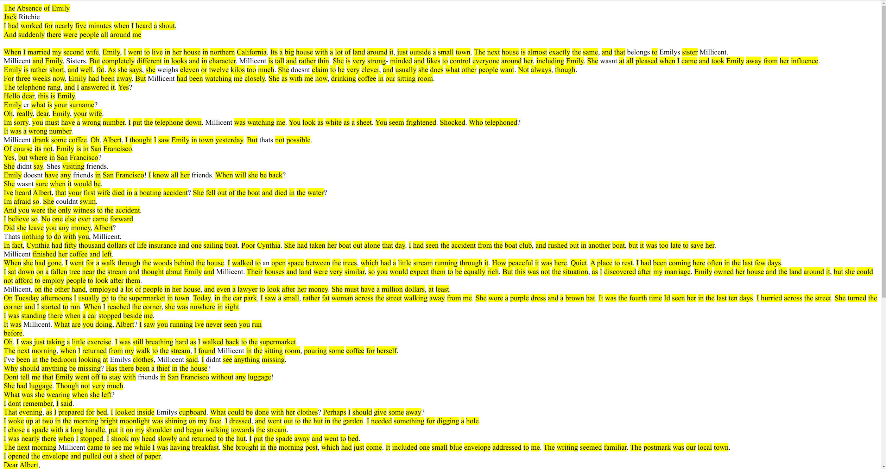

# Translator

A translator was written based on my hash table. It loads a dictionary of words into a table, then creates an output html page on which the translated words are highlighted, when you hover over them, the translation will appear.

## For example

### **I hope this will help you in learning English!**